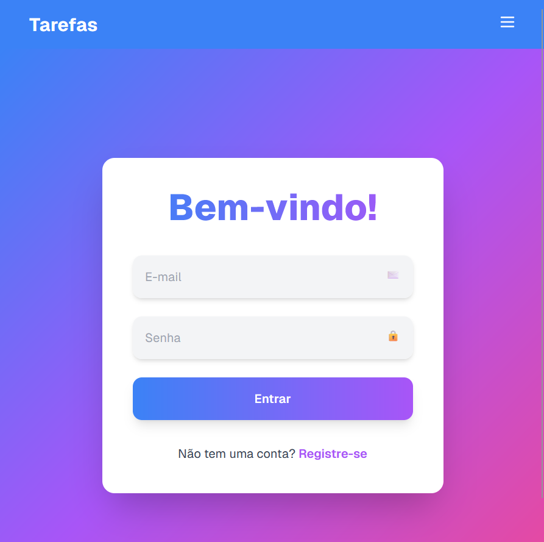
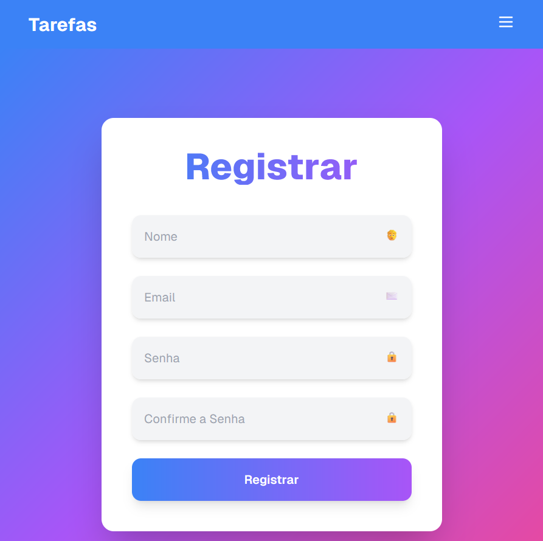
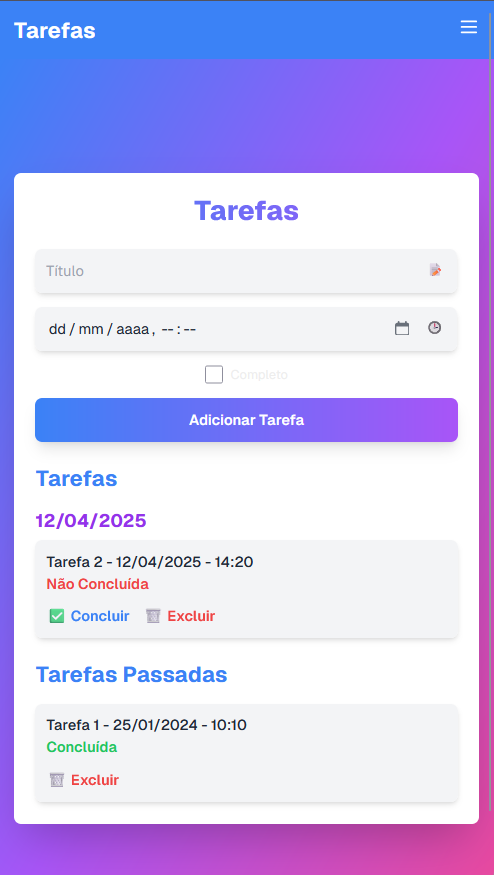
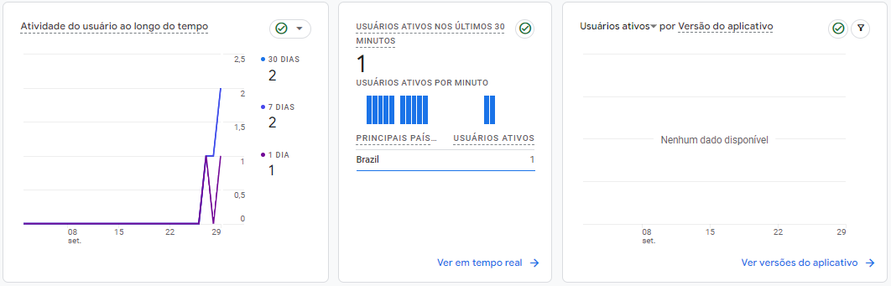
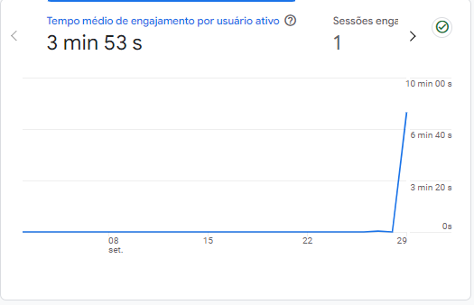
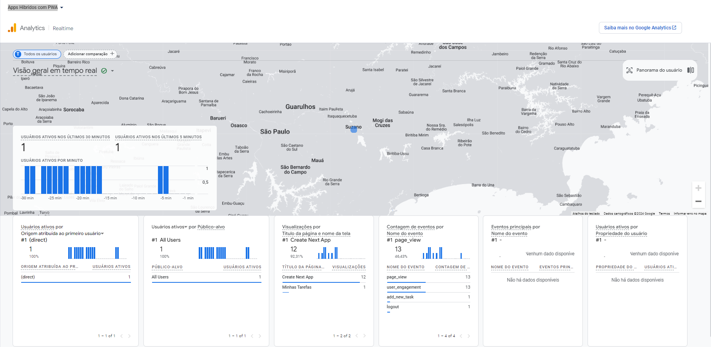

# Victor Pereira Aguiar

Apps Hibridos com PWA

## Prints do aplicativo

Print Tela Login

Print Tela Registrar Login

Print Tela Home Lista Tarefas

Print Tela Perfil

Relatório de Usuarios

Relatório de Engajamento

Relatório Realtime Firebase

